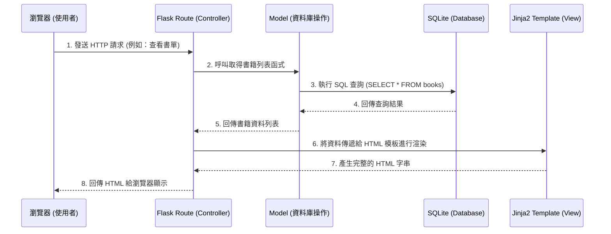

# 讀書筆記本系統架構設計

## 1. 技術架構說明

本專案採用輕量級的技術堆疊，適合快速開發與學習：

- **後端框架**：Python + Flask
  - **原因**：Flask 是一個微型 Web 框架，學習曲線平緩，非常適合中小型專案。它不會強迫使用者使用特定的資料庫或模板引擎，具有很高的靈活性。
- **模板引擎**：Jinja2
  - **原因**：Flask 內建支援 Jinja2，可以很方便地將 Python 變數傳遞到 HTML 模板中，在後端直接渲染出完整的網頁結構。本專案不採用前後端分離架構，以降低初期開發難度。
- **資料庫**：SQLite
  - **原因**：SQLite 是一個輕量級的關聯式資料庫，不需要獨立的伺服器進程，所有資料都儲存在單一檔案中（`database.db`），非常適合 MVP 階段與單機使用。

### Flask MVC 模式說明
雖然 Flask 本身沒有嚴格規定架構，但本專案將採用類似 MVC（Model-View-Controller）的模式來組織程式碼：
- **Model (模型)**：負責與 SQLite 資料庫溝通，處理資料的儲存、查詢、更新與刪除（例如書籍資料表）。
- **View (視圖)**：負責呈現使用者介面。在這個專案中，View 就是 Jinja2 HTML 模板，負責將資料顯示給使用者看。
- **Controller (控制器)**：由 Flask 的 Routes（路由）擔任。負責接收使用者的請求（例如點擊按鈕、提交表單），呼叫 Model 處理資料，最後將結果交給 View 來渲染畫面。

## 2. 專案資料夾結構

本專案將採用模組化的結構，將不同職責的程式碼分開，方便未來維護與擴充：

```text
web_app_development/
├── app/                        # 應用程式主目錄
│   ├── __init__.py             # 初始化 Flask app 與資料庫連線
│   ├── models/                 # Model 層：處理資料庫邏輯
│   │   └── book_model.py       # 書籍與筆記相關的資料庫操作
│   ├── routes/                 # Controller 層：處理 URL 路由與業務邏輯
│   │   └── book_routes.py      # 處理書籍相關的 HTTP 請求
│   ├── templates/              # View 層：Jinja2 HTML 模板
│   │   ├── base.html           # 共用的 HTML 骨架（導覽列、頁尾）
│   │   ├── index.html          # 首頁（書單列表）
│   │   └── form.html           # 新增/編輯書籍的表單頁面
│   └── static/                 # 靜態資源檔案
│       ├── css/                # 樣式表
│       ├── js/                 # 負責前端互動的 JavaScript
│       └── uploads/            # 使用者上傳的書本封面圖片
├── instance/                   # 存放應用程式執行時產生的檔案 (不進版控)
│   └── database.db             # SQLite 資料庫檔案
├── docs/                       # 專案文件目錄
│   ├── PRD.md                  # 產品需求文件
│   └── ARCHITECTURE.md         # 系統架構設計文件 (本文件)
├── requirements.txt            # Python 套件依賴清單
└── app.py                      # 應用程式進入點，負責啟動伺服器
```

## 3. 元件關係圖

以下是使用者操作系統時，各元件之間的互動流程：



## 4. 關鍵設計決策

1. **不採用前後端分離，使用 SSR（伺服器端渲染）**：
   - **原因**：為了加快開發速度並降低複雜度，我們選擇讓 Flask 直接透過 Jinja2 渲染 HTML（Server-Side Rendering），而不是建立獨立的 React/Vue 前端。這減少了處理 API 跨域（CORS）與前端狀態管理的負擔。
2. **圖片上傳儲存於本地資料夾 (`static/uploads/`)**：
   - **原因**：在 MVP 階段，將封面圖片直接存在伺服器的本地資料夾是最簡單的做法。資料庫中只儲存圖片的路徑（URL）。這避免了將二進位圖片直接存入 SQLite 可能導致的效能與檔案過大問題。
3. **資料庫連線的集中管理**：
   - **原因**：將所有的資料庫存取邏輯封裝在 `models` 資料夾中，而不是直接在 `routes` 裡寫 SQL 語句。這樣做不僅讓程式碼更乾淨，未來如果需要更換資料庫或修改查詢邏輯，也只需修改 Model 層即可。
4. **目錄結構模組化 (Blueprints 的潛在應用)**：
   - **原因**：雖然本專案為小型應用，但將路由（routes）與資料模型（models）拆分，有助於未來如果系統變大時，順暢地過渡為使用 Flask Blueprints 管理。
