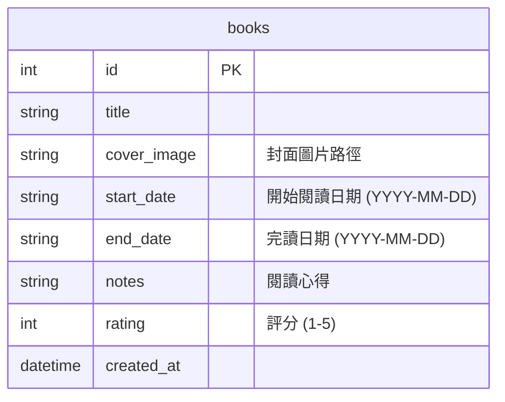

# 讀書筆記本系統資料庫設計

## 1. ER 圖（實體關係圖）

## 2. 資料表詳細說明

### `books` 資料表
儲存使用者的所有讀書紀錄與心得。

| 欄位名稱 | 型別 | 必填 | 說明 |
| --- | --- | --- | --- |
| `id` | INTEGER | 是 | Primary Key，自動遞增 |
| `title` | TEXT | 是 | 書名 |
| `cover_image` | TEXT | 否 | 封面圖片檔案路徑 (例如: `static/uploads/cover.jpg`) |
| `start_date` | TEXT | 否 | 開始閱讀日期 (格式：`YYYY-MM-DD`) |
| `end_date` | TEXT | 否 | 完讀日期 (格式：`YYYY-MM-DD`) |
| `notes` | TEXT | 是 | 閱讀心得與筆記 |
| `rating` | INTEGER | 是 | 書籍評分，限制範圍為 1 到 5 |
| `created_at` | DATETIME | 是 | 紀錄建立時間，預設為當前時間 |

## 3. SQL 建表語法

完整的建表語法請參考 `database/schema.sql` 檔案。

## 4. Python Model 程式碼

針對 `books` 資料表的 CRUD 操作，實作於 `app/models/book_model.py` 中。
