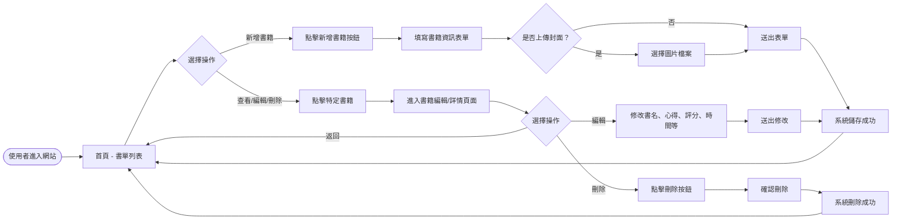
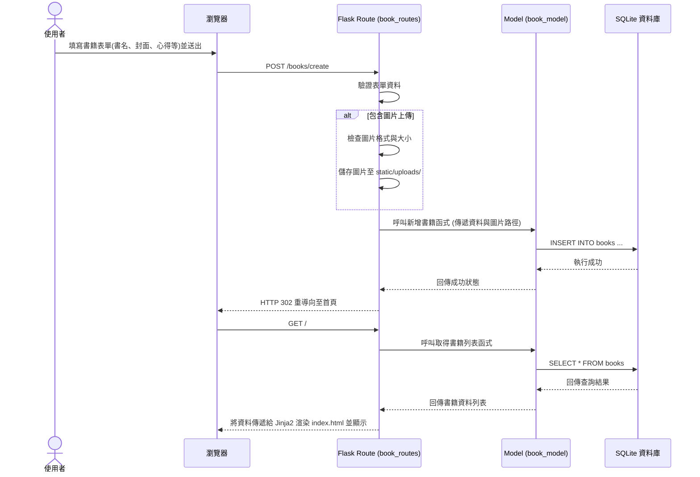

# 讀書筆記本系統流程圖

## 1. 使用者流程圖 (User Flow)

這張圖描述了使用者在讀書筆記本系統中的操作路徑。

## 2. 系統序列圖 (Sequence Diagram)

這張圖描述了從「使用者提交新增書籍表單」到「資料存入資料庫」並返回畫面的完整後端處理流程。

## 3. 功能清單對照表

| 功能名稱 | 說明 | URL 路徑 | HTTP 方法 | 對應的 View (模板) |
| --- | --- | --- | --- | --- |
| **首頁/書單列表** | 顯示所有已記錄的書籍列表 | `/` 或 `/books` | `GET` | `index.html` |
| **新增書籍表單** | 顯示新增書籍的輸入表單 | `/books/create` | `GET` | `form.html` |
| **儲存新增書籍** | 接收表單資料，儲存圖片與資料庫紀錄 | `/books/create` | `POST` | (重導向至 `/`) |
| **編輯書籍表單** | 顯示修改書籍資料的表單 (帶有預設值) | `/books/<id>/edit` | `GET` | `form.html` |
| **更新書籍資料** | 接收修改後的資料並更新至資料庫 | `/books/<id>/edit` | `POST` | (重導向至 `/`) |
| **刪除書籍** | 刪除指定的書籍紀錄與關聯圖片 | `/books/<id>/delete` | `POST` | (重導向至 `/`) |
